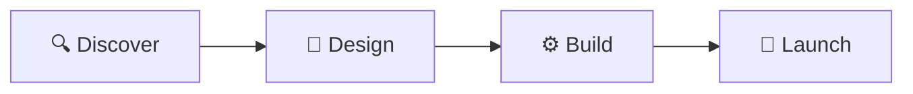

 

 

[About](#-about) · [What We Do](#-what-we-do) · [Selected Work](#-selected-work) · [Process](#-how-we-work) · [Tech](#-tech-we-build-with) · [Work With Us](#-work-with-us)

---

## ✨ About

**Superior Inc** is a product studio that pairs world-class design with production-grade engineering. We take startups from idea to a polished, scalable product without the usual delays: no drama, no bloated process, just shipped work.

Our teams own the full path from interface design to deployed code, so what you approve in design is exactly what reaches production.

| 🏆 | 🚀 | ⏱️ | 🌐 |
| :---: | :---: | :---: | :---: |
| **Award-winning** product studio | **10 products** showcased | **6–8 weeks** typical delivery on showcased projects | **Web & Mobile** apps and platforms |

## 🛠️ What We Do

| | Capability | What it covers |
| :---: | --- | --- |
| 🎨 | **Product Design** | UX research, UI systems, prototypes and brand-aligned interfaces |
| 🖥️ | **Web Applications** | SaaS platforms, dashboards, landing pages, portfolios and internal tools |
| 📱 | **Mobile Applications** | Cross-platform mobile apps built for real-world scale |
| ⚙️ | **Engineering** | Production-grade, maintainable code built to grow with your product |

## 🗂️ Selected Work

A sample of the products we have designed and built. Full details are on our [services page](https://www.superiorinc.uk/services).

| | Project | Category | Description |
| :---: | --- | --- | --- |
| ✈️ | **Tripwise** | `SaaS` | Smart travel platform |
| 🤖 | **Resolve** | `SaaS` | AI support agent |
| 🩺 | **HealthOS** | `SaaS` | Connected care operating system |
| 🧠 | **Cognitest** | `IQ Testing` | Clinical IQ and cognitive assessments |
| 🧩 | **SuperiorAI** | `UI Builder` | From design to working UI |
| 🎙️ | **Verbly** | `Dictation` | AI voice dictation |
| 🎵 | **Soul King** | `Music` | Anime OST player and catalog |
| 💰 | **Finance Tracker** | `Dashboard` | Personal finance dashboard |
| 🚀 | **Startup Launch** | `Landing Page` | Conversion-focused launch site |
| 🖼️ | **Creative Portfolio** | `Portfolio` | Showcase site for creatives |

## 🧭 How We Work

| Step | What happens |
| --- | --- |
| 🔍 **Discover** | We align on your goals, users and scope. |
| 🎨 **Design** | We craft interfaces and flows you can review and refine early. |
| ⚙️ **Build** | We engineer production-ready code with performance and scalability in mind. |
| 🚀 **Launch** | We ship, hand over, and make sure you are ready to grow. |

## 💎 Principles

- **Design and code, together.** Design quality and engineering quality are one standard, not two.
- **Speed without shortcuts.** Fast delivery, built on maintainable foundations.
- **Clarity over noise.** Straightforward communication and honest timelines.
- **Built to scale.** Every product is designed to grow past its first release.

## 🧰 Tech We Build With

## 🤝 Work With Us

Ready to build something? Explore our work, review our plans, and get started.

## 📦 Repositories

Public repositories in this organisation are listed on the **Repositories** tab. Each repository includes its own README with setup instructions and contribution guidelines.

<b>🤲 Contributing</b>

 

Contributions to our open repositories are welcome.

1. Fork the repository and create a feature branch.
2. Make your changes with clear, focused commits.
3. Open a pull request describing what changed and why.

Please follow the conventions in each repository's own documentation.

<b>📄 License</b>

 

Unless stated otherwise in an individual repository, code in this organisation is proprietary to Superior Inc. See each repository for its specific license terms.

 

© Superior Inc. All rights reserved.

